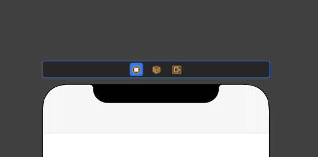
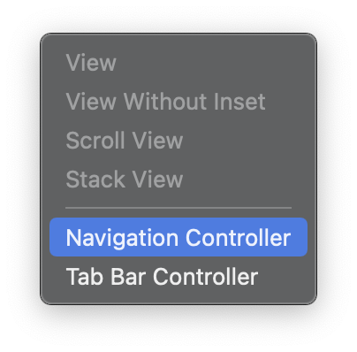
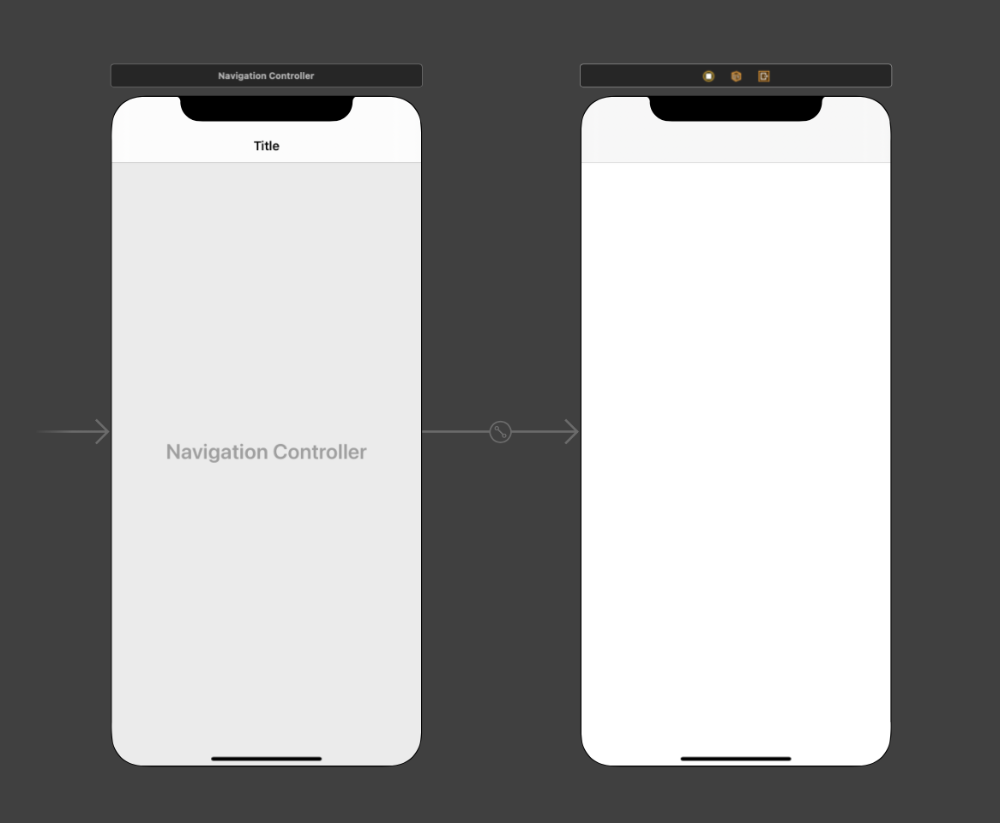
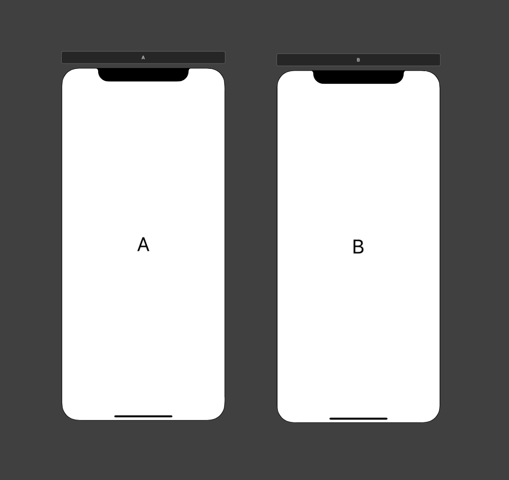
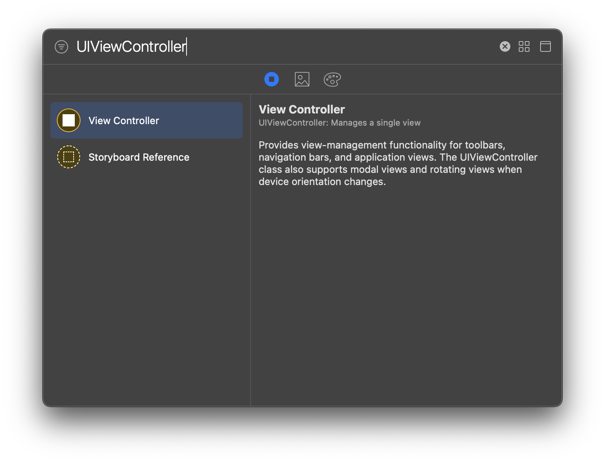
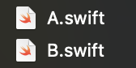
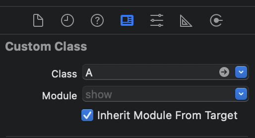
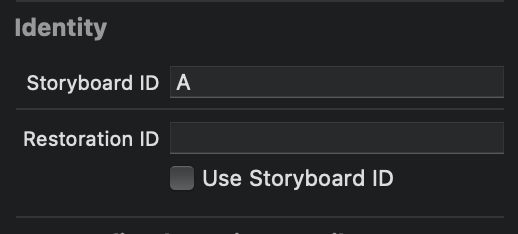
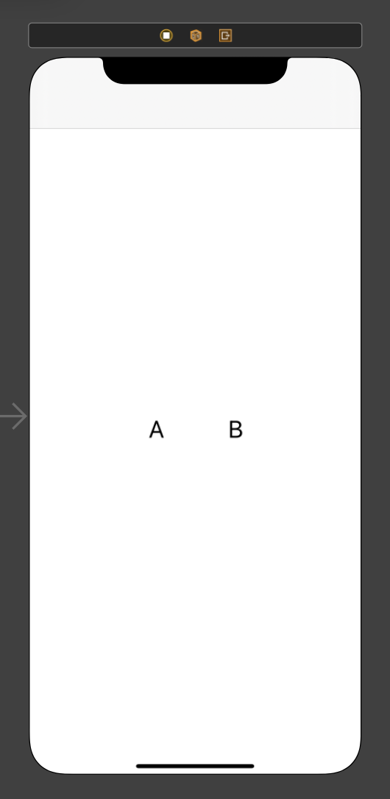

# **Show**


- #### ```show```를 활용하여 화면전환을 해보자! with storyboard 👩🏻‍💻

##### iOS 전공 동아리에서 멘토 멘티를 시작했는데 내 멘티가 show함수를 사용한 화면전환에 대해 질문을 하길래 한번 정리해봤다! 

- ###### (항상 코드로만 구현하다가 스토리보드를 쓰려니 어색하지만 스토리보드를 한번 더 경험할 수 있는 기회가 생겨 좋았다!)

- ##### ViewController에는 두개의 버튼이 있고, 각 버튼을 누르면 각 뷰컨(A, B)으로 이동한다.

##### 1. 먼저 기존에 있던 뷰컨에 NavigationController를 Embeded in 해주자!
###### Show함수를 사용하기위해서 NavigationController를 넣는것은 아니고 자동으로 생성되는 back 버튼을 사용하기 위해 넣어주는 것이다 😃

- ##### 화면 위에 검은색 바를 클릭하고 위의 상태바에서 Editor를 선택해준다.
## <p align="center">  </p>

## <p align="center">  </p>

- ###### Editor를 클릭하고 Embeded in를 클릭해주면 아래 같은 창이 뜨는데 Navigation Controller를 클릭해주자
## <p align="center">  </p>

- ###### 클릭하면 navigationController가 연결된 모습을 볼 수 있을 것이다 🦾
## <p align="center">  </p>


##### 2. 화면전환하여 도착할 뷰컨을 만들어주자!
## <p align="center">  </p>
- ###### + 버튼을 누르고 UIVIewController를 검색하여 Drag&Drop 해보자 (2개!)

## <p align="center">  </p>

- ###### 그리고 swift파일 2개를 만들어 각각 연결해주자
###### A.swift, B.swift를 생성해준다 ✌🏻

## <p align="center">  </p>

- ###### storyboard로 돌아가서 스크린의 검은색 바를 클릭한 후 오른쪽의 4번째 버튼을 누르고 class 명을 입력하여 파일과 스토리보드를 연결해주자!

## <p align="center">  </p>

- ###### 그리고 그 아래 identity도 설정해주자
##### 코드에서 스토리보드 화면에 접근할 때 아이디를 통해 접근할 수 있다 🙆🏻‍♀️
## <p align="center">  </p>


##### 3. 메인 뷰컨에서 버튼을 생성해주자 
- ###### 메인 뷰컨으로 돌아가서 버튼 두개를 만들어주자
## <p align="center">  </p>

##### 4. 화면전환 코드를 써보자

```swift
import UIKit

class ViewController: UIViewController {
    // 스토리보드에 접근할 수 있게 스토리보드 변수를 만들어주었다
    let myStoryBoard: UIStoryboard = UIStoryboard(name: "Main", bundle: nil)

    // 각 버튼의 Outlet를 설정해주었다. (control + drag&drop)
    @IBOutlet weak var goA: UIButton!
    @IBOutlet weak var goB: UIButton!

    override func viewDidLoad() {
        super.viewDidLoad()
    }

    // 각 버튼의 Action을 설정해주었다. (control + drag&drop)
    @IBAction func goA(_ sender: Any) {
        // 스토리보드의 a화면을 코드에서 접근할 수 있게 변수로 선언해주었다.
        let aController = myStoryBoard.instantiateViewController(identifier: "A")
        
        // a화면을 보여줘라
        self.show(aController, sender: self)
    }
    
    @IBAction func goB(_ sender: Any) {
        // 스토리보드의 b화면을 코드에서 접근할 수 있게 변수로 선언해주었다.
        let bController = myStoryBoard.instantiateViewController(identifier: "B")
        
        // b화면을 보여줘라
        self.show(bController, sender: self)
    }

}
```

