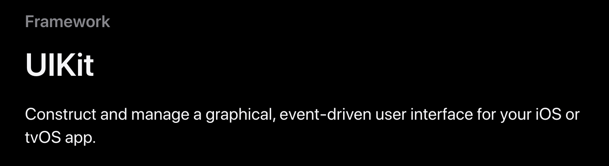

# **UIKit**

- #### ```UIKit``` 이해해보기 with Youjin 👩🏻‍💻

###### 개발하다보면 코드 상단에 위치해있는 이것을 자주 볼 수 있을 것이다. 그래서 이게 뭔데?
```Swift
import UIKit
```

### UIKit이 뭐야?
###### 공식문서를 보면 ~
- #### iOS 또는 tvOS 앱을 위한 그래픽 이벤트 기반 사용자 인터페이스를 구성하고 관리합니다.
> ##### 즉, 앱에 ```사용자와 소통할 수 있는 매개체(버튼, 라벨 등)```를 구성하고 관리하는 프레임워크!
## <p align="left">  </p>

### UIKit에대해 더 알아보자 ~
- #### ```UIKit 클래스 중 UIResponder 에서 파생된 클래스나, UI에 관련된 클래스는 앱의 메인 스레드(or 메인 디스패치 큐) 에서만 사용할 것!```
- #### ```앞에 UI가 붙어있는 요소들(UIButton, UILabel, UIView)은 모두 import UIKit을 한 후 사용해야한다 ```

### 그래서 UIKit이 뭘 한다는 거야 🤥
- ##### UIKit의 기능으로는 크게 ```User Interface```와 ```User Interactions```가 있다!

### 1. User Interface
- #### ```응답자 및 제스처 인식기는 터치 및 기타 이벤트를 처리하는 데 도움이 됩니다. 드래그 앤 드롭, 포커스, 엿보기 및 팝업, 접근성은 다른 사용자 상호 작용을 처리합니다. ```

> User Interface에는 뭐가 있을까?
``` Swift
View and Control : 화면에 컨텐츠 표시

View Controller : UI 관리

View Layout : 스택 뷰를 사용해 인터페이스를 나타냄

Appearance Customization : 다크 모드, bar 커스터마이징 등

Animation and Haptics : 애니메이션과 햅틱을 통한 피드백 제공

Window and Screen : 뷰 계층을 위한 윈도우 제공
```
### 2. User Interactions
- #### ```보기는 콘텐츠를 화면에 표시하고 사용자 상호 작용을 용이하게 하는 데 도움이 됩니다. 보기 컨트롤러는 보기와 인터페이스 구조를 관리하는 데 도움이 됩니다.```

> User Interactions에는 뭐가 있을까?
``` Swift
Touch, Press, Gesture : 제스처 인식기를 통한 이벤트 처리 로직

Drag and Drop : 화면 위에서 드래그 앤 드롭
```


### END!

